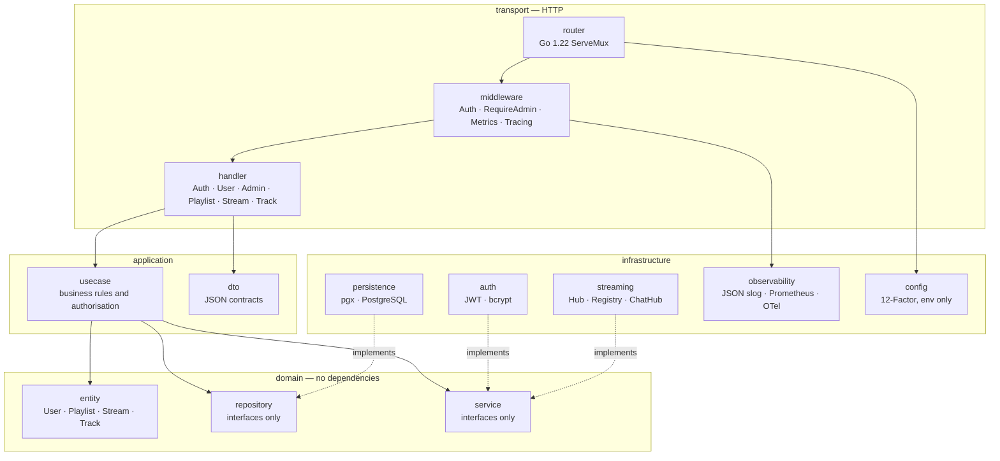
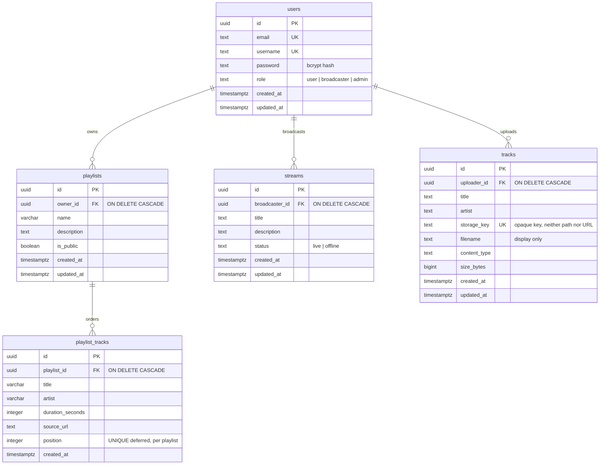
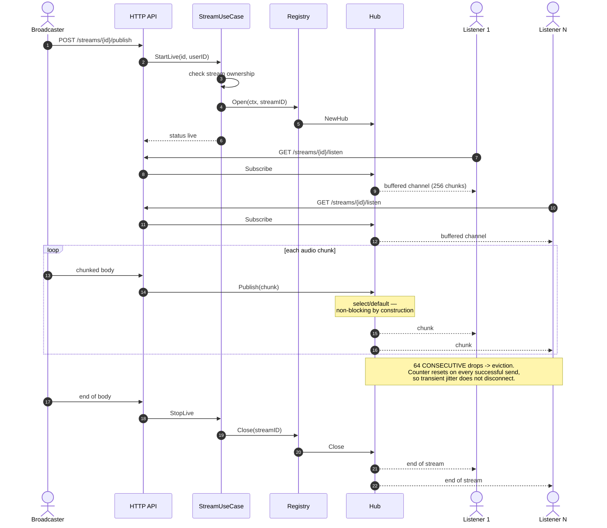
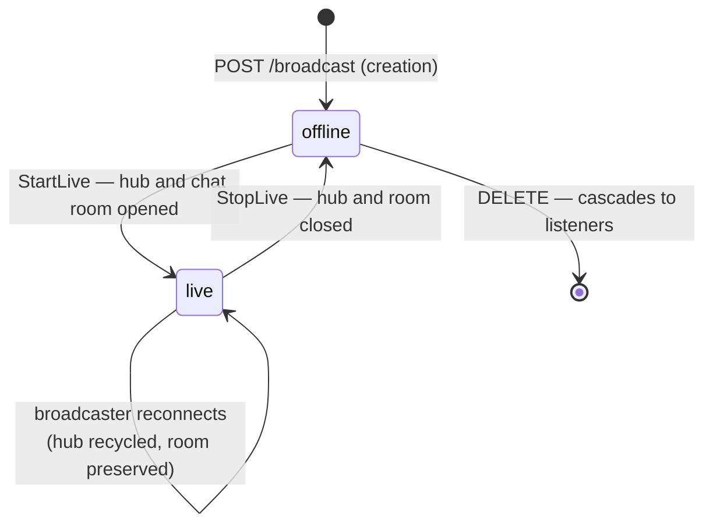
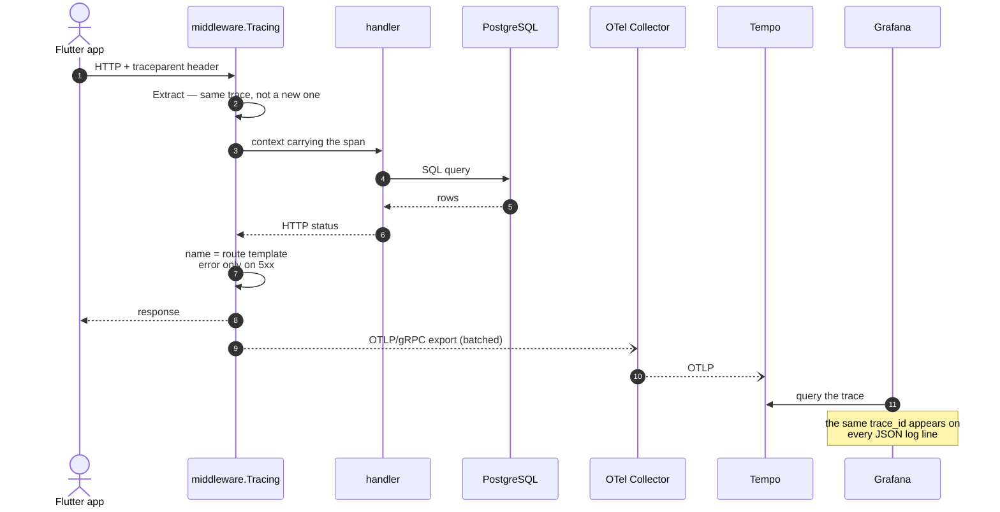
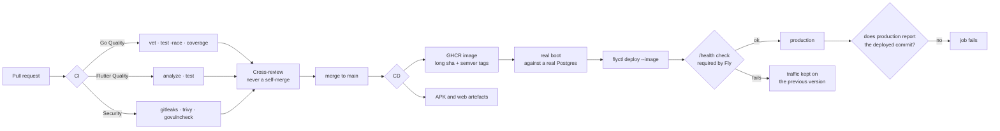

# Diagrams — StreamPulse

> French version: [`README.md`](README.md).
> RNCP criterion: **Ce3.6.1** ("a language allowing the components to be visualised in a standardised way").

**Mermaid** notation, rendered natively by GitHub: the diagrams are versioned text, reviewed in PRs and diffed like code. An exported image diverges from the code at the first refactor and nobody notices.

---

## 1. Layered architecture (component diagram)

The dependency rule is one-way: `domain` knows nobody, everybody knows `domain`.

**What the diagram makes visible**: no arrow leaves `domain`. Infrastructure implementations point at the domain's interfaces, never the other way round — which is what makes a use case testable with an in-memory repository, and lets local storage be swapped for S3 without touching business code.

## 2. Data model (entity-relationship)

**Two decisions readable straight off the schema**:

- Every `ON DELETE CASCADE` points at `users`. That is what makes the GDPR account deletion (Y2) correct **without Y2 knowing these tables exist**: each slice declares its own cascade when it lands.
- `uq_playlist_tracks_position` is `DEFERRABLE INITIALLY DEFERRED`: reordering rewrites positions row by row inside a transaction, and uniqueness is only checked at `COMMIT` — otherwise the first write would collide with a position not yet moved.

## 3. Live streaming: one broadcaster, N listeners (sequence)

**The non-obvious point**: the broadcaster's HTTP response is written **at the end**, not up front. A conforming HTTP client stops sending the body as soon as a response arrives — answering `200 OK` immediately cut the broadcast at the first chunk. Only authorisation refusals answer straight away, which is exactly what tells a rejected broadcaster to stop transmitting.

## 4. Stream lifecycle (state)

**The asymmetry on the `live --> live` transition is deliberate.** The audio hub is fed by exactly one publisher connection: when the broadcaster reconnects it must be recycled, otherwise listeners stay attached to a hub nobody feeds any more. The chat room has no privileged participant — recycling it would eject the whole conversation on a two-second network drop.

## 5. Distributed trace of one request (sequence)

## 6. From PR to production (deployment)

**What the diagram encodes**: the deployed image is **the one that was verified**, not a second build that resembles it (`--image`, never a build by the host). Plus two guards after the fact — Fly only switches traffic if `/health` passes, and the job fails if production does not report the run's commit, because a "successful" deployment still serving the old version is the failure mode nobody notices.
