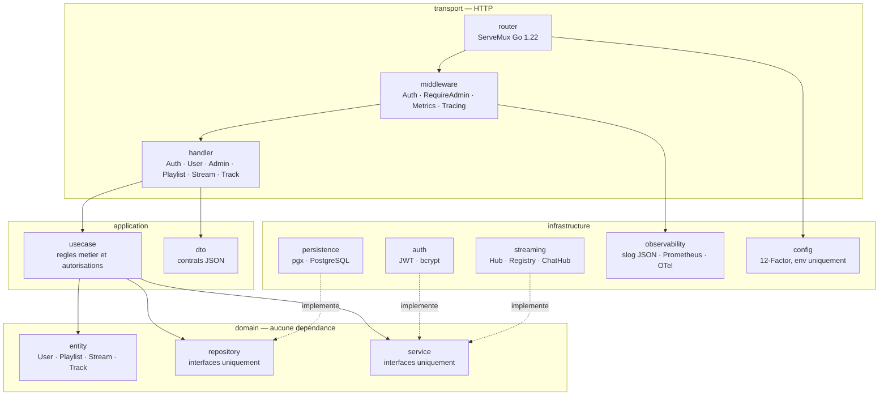
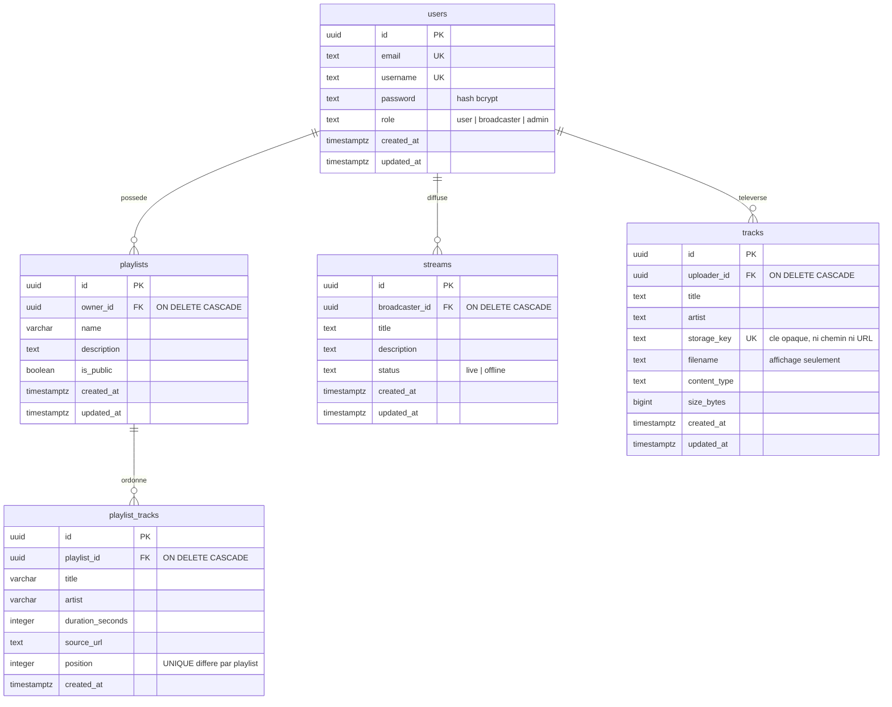
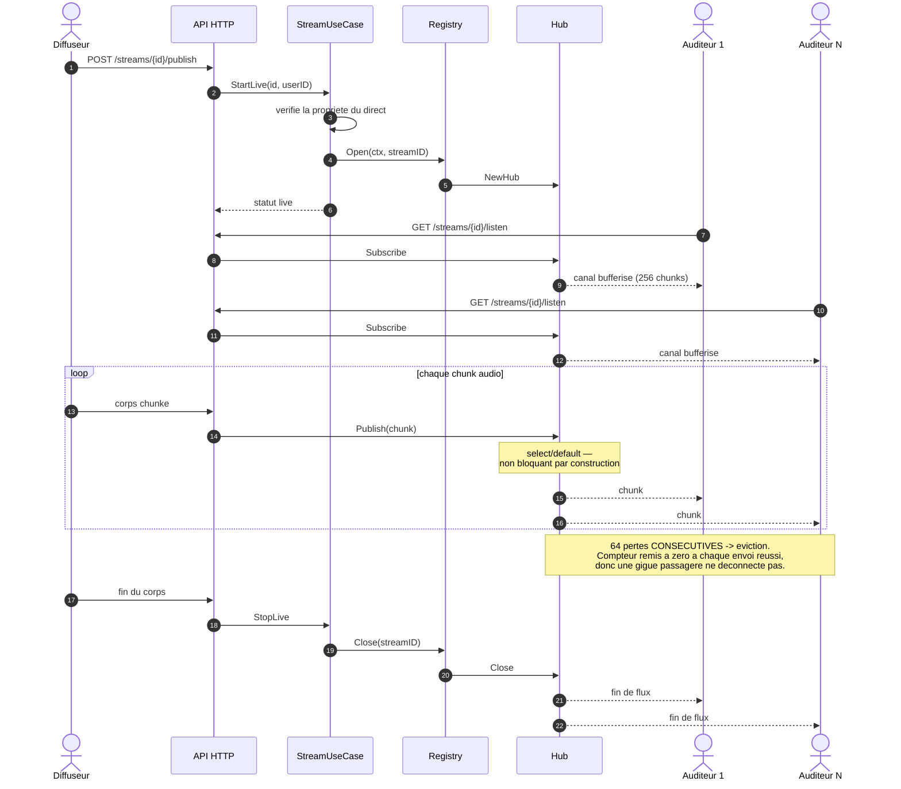
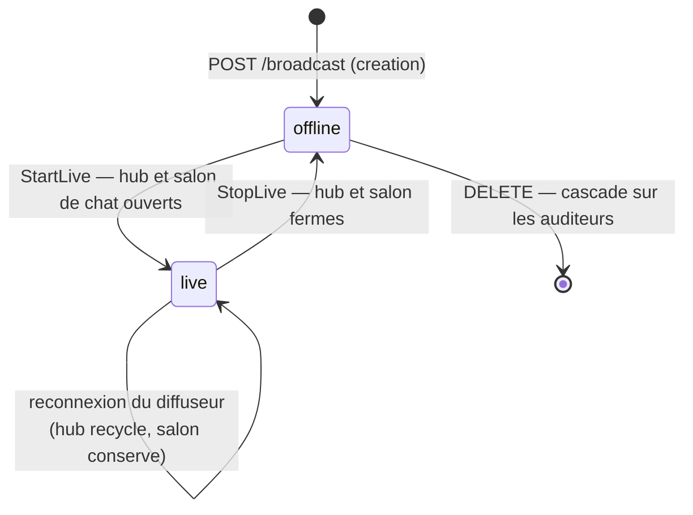
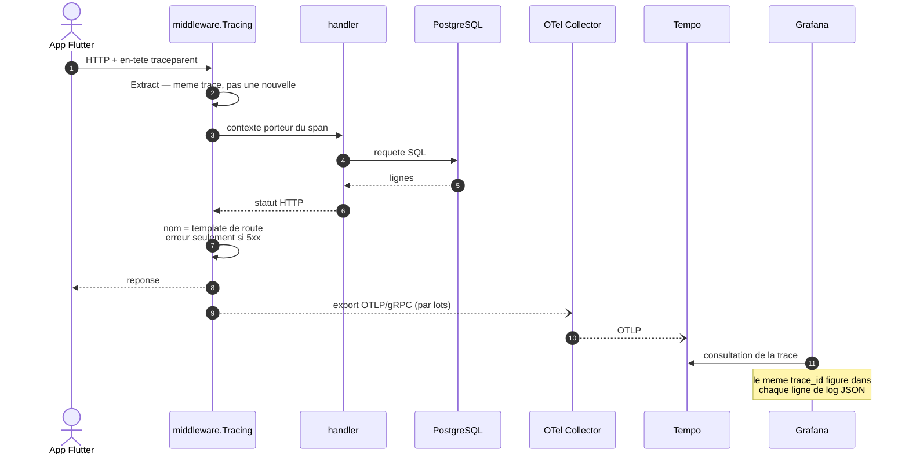
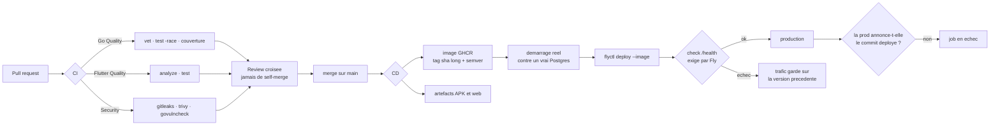

# Diagrammes — StreamPulse

> Version anglaise : [`README.en.md`](README.en.md).
> Critère RNCP visé : **Ce3.6.1** (« langage qui permet de visualiser les composantes de façon standardisée »).

Notation **Mermaid**, rendue nativement par GitHub : les diagrammes sont du texte versionné, relu en PR et diffé comme du code. Une image exportée diverge du code au premier refactor sans que personne le voie.

---

## 1. Architecture en couches (diagramme de composants)

La règle de dépendance est unidirectionnelle : `domain` ne connaît personne, tout le monde connaît `domain`.

**Ce que le diagramme rend visible** : aucune flèche ne part de `domain`. Les implémentations d'infrastructure pointent vers les interfaces du domaine, jamais l'inverse — c'est ce qui permet de tester un usecase avec un dépôt en mémoire, et de remplacer le stockage local par S3 sans toucher au métier.

## 2. Modèle de données (entité-association)

**Deux décisions lisibles directement sur le schéma** :

- Tous les `ON DELETE CASCADE` pointent vers `users`. C'est ce qui rend la suppression de compte RGPD (Y2) correcte **sans que Y2 connaisse l'existence de ces tables** : chaque tranche déclare sa propre cascade quand elle arrive.
- `uq_playlist_tracks_position` est `DEFERRABLE INITIALLY DEFERRED` : le réordonnancement réécrit les positions ligne par ligne dans une transaction, et l'unicité n'est vérifiée qu'au `COMMIT` — sinon la première écriture entrerait en collision avec une position pas encore déplacée.

## 3. Diffusion live : un diffuseur, N auditeurs (séquence)

**Le point non évident** : la réponse HTTP du diffuseur est écrite **à la fin**, pas au début. Un client HTTP conforme arrête d'envoyer le corps dès qu'une réponse arrive — répondre `200 OK` d'emblée coupait la diffusion au premier chunk. Seuls les refus d'autorisation répondent immédiatement, ce qui est précisément ce qui dit à un diffuseur refusé d'arrêter d'émettre.

## 4. Cycle de vie d'un direct (états)

**L'asymétrie de la transition `live --> live` est délibérée.** Le hub audio est alimenté par exactement une connexion de publication : quand le diffuseur se reconnecte, il faut le recycler, sinon les auditeurs restent accrochés à un hub que plus personne n'alimente. Le salon de chat, lui, n'a aucun participant privilégié — le recycler éjecterait toute la conversation à la première coupure réseau de deux secondes.

## 5. Trace distribuée d'une requête (séquence)

## 6. De la PR à la production (déploiement)

**Ce que le diagramme encode** : l'image déployée est **celle qui a été vérifiée**, pas un second build qui lui ressemble (`--image`, jamais un build par l'hébergeur). Et deux garde-fous après coup — Fly ne bascule le trafic que si `/health` passe, et le job échoue si la production ne rapporte pas le commit du run, parce qu'un déploiement « réussi » qui sert encore l'ancienne version est le mode de panne qu'on ne voit pas.
